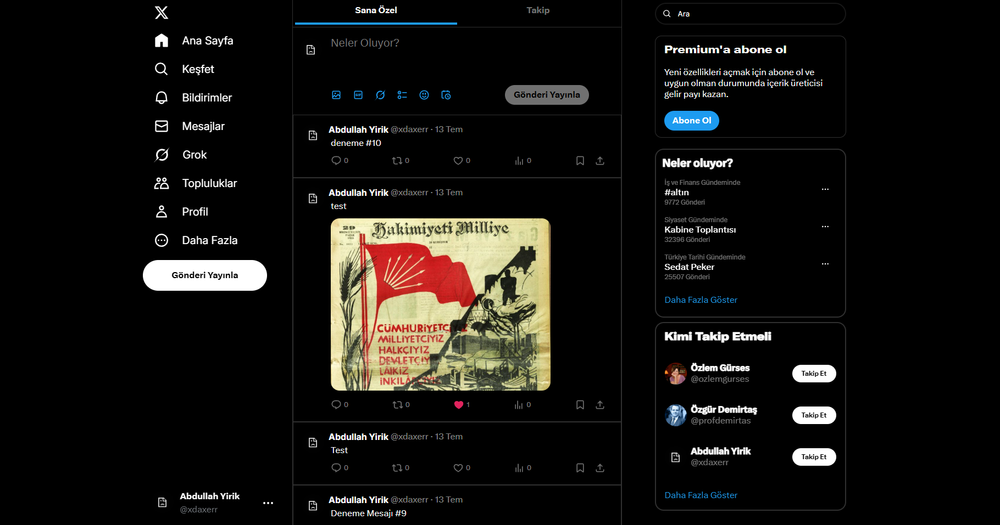

# 🐦 X (Twitter) Clone




A **full-stack social media platform** that replicates the core features of Twitter (now X), built using modern web technologies. The project includes **real-time messaging**, **user authentication**, **post creation with media**, and a **like system**, all designed with a clean and responsive user interface.

## 🚀 Features

- 🔐 **JWT-Based Authentication** — Secure user login and protected routes
- 📝 **Post with Text and Images** — Share tweets with media attachments
- ❤️ **Like System** — Interact with posts via likes
- 💬 **Real-Time Messaging** — Instant messaging using Socket.IO
- 🔍 **Dynamic Search** — Quickly find users and content

## 🛠️ Tech Stack

### Frontend

- **React**
- **Context API**
- **CSS Modules**

### Backend

- **Node.js + Express**
- **JWT for Authentication**
- **Socket.IO for Real-Time Communication**
- **SQLite (via better-sqlite3)**

## 📂 Project Structure

```
/client → React frontend
/server → Express backend
/server/database → SQLite database files

```

## 🎯 Highlights

This project demonstrates:

- 🔁 Real-time communication with Socket.IO
- 🔐 Secure user session handling via JWT
- 🧠 State management using Context API
- 🖼️ Media uploads and rendering
- 📐 Scalable backend structure with lightweight database

## 📦 Installation & Usage

### 1. Clone the Repository

```bash
git clone https://github.com/yourusername/x-clone.git
cd x-clone
```

### 2. Start the Backend

```bash

cd ../client
npm install
npm start


```

### DEMO 

🌐 Live Demo: [[socialmedia.daxer.dev]](https://socialmedia.daxer.dev/)


# 💬 Feedback
I'm always open to feedback and suggestions!
Feel free to open an issue, contribute to the code, or reach out directly. 😊


###
If you found this project helpful, please consider giving it a ⭐!
